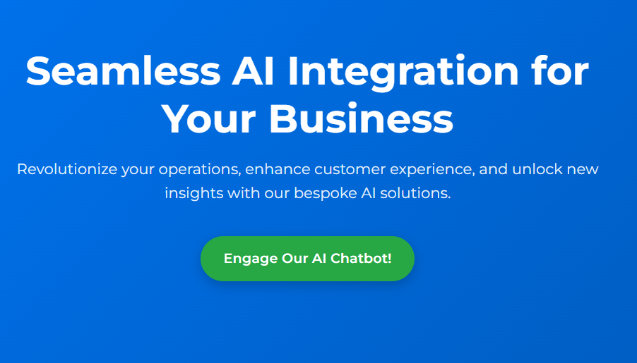

 # Web Page with Gemini Chatbot

This project demonstrates how to integrate Google's Gemini AI into a responsive web interface, enabling users to interact with an AI chatbot directly from their browser.

## 🚀 Features

- **Responsive Design**: Optimized for both desktop and mobile devices.
- **Gemini AI Integration**: Leverages Google's Gemini API for natural language processing.
- **User-Friendly Interface**: Clean and intuitive chat interface for seamless interactions.
- **Light/Dark Mode**: Toggle between light and dark themes for user preference.

## 📸 Screenshots



*Example of the chatbot interface.*

## 🛠️ Technologies Used

- **Frontend**: HTML, CSS, JavaScript
- **Backend**: Node.js (for handling API requests)
- **AI Model**: Google Gemini API

## 🔧 Installation

1. Clone the repository:

   ```bash
   git clone https://github.com/spha-code/AI-Agents.git
   ```

2. Navigate to the project directory:

   ```bash
   cd AI-Agents/web-page-with-gemini-chatbot
   ```

3. Install dependencies:

   ```bash
   npm install
   ```

4. Set up your Gemini API key:

   Create a `.env` file in the root directory and add:

   ```env
   GEMINI_API_KEY="google_api_key_here"
   ```

5. Start the application:

   ```bash
   npm start
   ```

6. Open your browser and navigate to `http://localhost:3000` to interact with the chatbot.

## 📄 License

This project is licensed under the MIT License.
